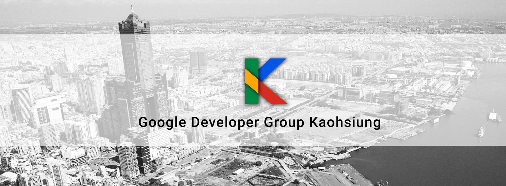

Google Develop Kaohsiung Blog
=============================
Google Develop Kashsiung 從 2014 年 3 月成立，社群名稱原為「Android 高雄開發者社群」，從事 Android App、Embedded 及 Design 一起交流的園地，但 Android 技術必須經常與其他技術配合，於 2015 年 6 月申請 GDG，並正式更名為「Google Develop Kashsiung」。

我們持續尋找講者與志工，若有興趣想要投稿或是了解我們歡迎寄信到 [benging1003@gmail.com](mailto:begining1003@gmail.com)。

### 社群聯絡方式
- Facebook 粉絲團：[https://www.facebook.com/groups/AKDGroup](https://www.facebook.com/groups/AKDGroup)
- 活動通（目前活動發佈）：[http://www.accupass.com/org/detail/r/1502251731101672014022/1/0](http://www.accupass.com/org/detail/r/1502251731101672014022/1/0)
- KKTIX：[http://akdg.kktix.cc/](http://akdg.kktix.cc/)
